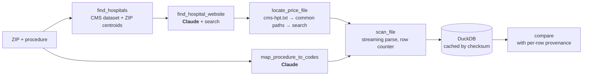

# hospital-price-agent

Give it a ZIP code and a procedure in plain English ("knee MRI"). It finds nearby hospitals,
tracks down their federally required price transparency files on the live web, streams
through files that can be several gigabytes, and compares cash prices side by side, showing
every step as it happens.

```
found 15 hospitals within 25 km of 77380
mapped "knee MRI" -> 73721, 73723 (confidence 0.91)
Houston Methodist The Woodlands: cms-hpt.txt found -> price file 2.1 GB, scanning
St. Luke's The Woodlands: cms-hpt.txt missing, searching site
Houston Methodist The Woodlands: 2 matching rows after 1.4M scanned
```
<sub>Target trace output. Today, the hospital search step works end to end; see the status below.</sub>

**Status: built in public.** This repo goes up one milestone at a time, and the checklist
below is kept current.

## Status

- [x] **1. Scaffold.** CMS hospital data + Census ZIP centroids in DuckDB, `find_hospitals` working
- [ ] **2. Find price files** for ~10 Houston-area hospitals; write up what breaks and how often
- [ ] **3. Streaming extraction** (CSV wide, CSV tall, JSON) into DuckDB, cached by file checksum
- [ ] **4. Pipeline + Claude** at the fuzzy steps, with a CLI trace
- [ ] **5. Web UI**: FastAPI + server-sent events, React split pane (trace left, results right)
- [ ] **6. Eval harness**: 20 hand-checked questions, accuracy reported here
- [ ] **7. Hosted demo** on pre-scanned Houston ZIPs, with live scans on request

## Try it

```bash
python3 -m venv .venv && source .venv/bin/activate
pip install -e '.[dev]'

hpa setup                         # downloads CMS + Census reference data (~8 MB), builds data/hpa.duckdb
hpa hospitals 77030 --radius 10   # Texas Medical Center
hpa hospitals 77380               # The Woodlands, 25 km default
pytest
```

## How it works



The pipeline is ordinary, testable Python. Claude is used only where the input is fuzzy:
turning "knee MRI" into billing codes, picking a hospital's official website, matching a
hospital to its entry in a health system's `cms-hpt.txt`, and reading files that don't follow
the CMS template. That keeps runs cheap and fast, and it means the eval harness is measuring
something meaningful.

Rules the system keeps:
- **Never invents a price.** A hospital that can't be resolved is listed as missing, with the reason.
- **Every number has its source**: the file URL and the date the hospital published it.
- **Percentages and algorithms stay as they are.** Some hospitals publish "60% of billed
  charges" instead of a dollar amount; that is shown as written, never converted into dollars.
- **Never loads a whole file into memory.** Price files are parsed as streams.

## Why hospital price data, and who actually uses it

Since July 2024, CMS has required every hospital to publish a machine-readable file of its
standard charges: the gross charge, the discounted cash price, and the minimum and maximum
rates it has negotiated with insurers. Compliance varies a lot. Missing index files, dead
links and non-standard layouts are common, and that messiness is a big part of what this
project handles.

Consumer price shopping mostly doesn't work. Most people with insurance pay a share of a
negotiated rate, not a list price. Emergencies can't be shopped. And the price of a
procedure depends on everything bundled with it. The people who do get value from this data
are **self-insured employers** deciding which hospitals to steer employees toward, **benefits
brokers and consultants** negotiating plan designs, and **patient advocacy services** helping
uninsured or high-deductible patients. The discounted cash price is the figure that is most
comparable across hospitals, which is why this project leads with it.

## Limitations

- **Distances are ZIP centroid to ZIP centroid**, not street addresses. Hospitals in the same
  ZIP all show 0.0 km, and a hospital near a ZIP boundary can be a few km off.
- About 2.5% of hospitals list a PO-box ZIP with no census centroid. They're placed at the
  nearest ZIP in the same 3-digit prefix and flagged as approximate.
- The CMS Hospital General Information dataset **leaves out PPS-exempt cancer hospitals**
  (e.g. MD Anderson), so they won't show up in results yet.
- VA and military hospitals are exempt from the price transparency rule and are excluded by
  default (`--all-types` includes them).
- Payer-specific negotiated rates are deliberately out of scope; only the four summary
  price columns are used.
- CPT code descriptions are AMA-copyrighted and are not included in this repo.

More will be added here as milestones land. Milestone 2 exists to find them.

## Data sources

- [CMS Hospital General Information](https://data.cms.gov/provider-data/dataset/xubh-q36u):
  hospital names, addresses, types
- [Census 2024 ZCTA Gazetteer](https://www.census.gov/geographies/reference-files/time-series/geo/gazetteer-files.html):
  ZIP centroids
- Hospital price transparency files, fetched live from each hospital's site
  ([CMS requirements](https://www.cms.gov/priorities/key-initiatives/hospital-price-transparency))

## License

MIT
