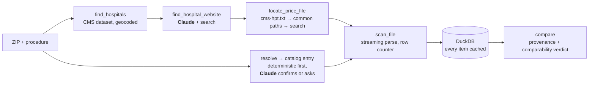

# hospital-price-agent

**The goal:** give it a ZIP code and one of the 70 services CMS asks hospitals to price
("knee MRI", "colonoscopy", "screening mammogram"), and it finds the nearest hospitals,
tracks down their price transparency files on the live web, streams through files that can
run to several gigabytes, and puts the cash prices side by side with a link to the exact
source row for every number, showing each step as it happens.

**Status: built in public, one milestone at a time.** What works today is below; the
roadmap further down is kept current.

## What works today

```
$ hpa hospitals 77030
nearest 5 hospitals to the centre of 77030
     0.2 mi  TEXAS CHILDRENS HOSPITAL  [453304, Childrens]
     0.3 mi  Baylor St Lukes Medical Center  [450193, Acute Care Hospitals]
     0.4 mi  HOUSTON METHODIST HOSPITAL  [450358, Acute Care Hospitals]
     0.5 mi  TEXAS ORTHOPEDIC HOSPITAL  [450804, Acute Care Hospitals]
     0.7 mi  HARRIS HEALTH  [450289, Acute Care Hospitals]

$ hpa hospitals 77385
nearest 5 hospitals to the centre of 77385
   ~0.0 mi  HOUSTON METHODIST THE WOODLANDS HOSPITAL  [670122, Acute Care Hospitals]  (ZIP centroid)
     2.1 mi  CHI ST LUKES LAKESIDE HOSPITAL  [670059, Acute Care Hospitals]
     ...

$ hpa locate 77339
locating price files for 5 hospitals
Kingwood Pines Hospital: cms-hpt.txt found at https://kingwoodpines.com/wp-content/uploads/2025/08/cms-hpt.txt
Kingwood Pines Hospital: 1 entries, matched Kingwood Pines Hospital (100)
Kingwood Pines Hospital: price file csv, 129 KB, modified Tue, 01 Sep 2026 22:35:00 GMT
HCA Houston Healthcare Kingwood: cms-hpt.txt found at https://www.hcahoustonhealthcare.com/cms-hpt.txt
HCA Houston Healthcare Kingwood: 36 entries, matched HCA HOUSTON KINGWOOD (100)
HCA Houston Healthcare Kingwood: price file json, 860 MB, modified Wed, 27 May 2026 21:42:37 GMT
Memorial Hermann Surgical Hospital Kingwood: cms-hpt.txt found at https://memorialhermann.org/cms-hpt.txt
Memorial Hermann Surgical Hospital Kingwood: 19 entries, none resemble MEMORIAL HERMANN SURGICAL HOSPITAL KINGWOOD
Townsen Memorial Hospital: no cms-hpt.txt at townsenmemorial.com, but 1 standard-charges link(s) on https://www.townsenmemorial.com/pricing-transparency
Townsen Memorial Hospital: standard charges file linked: https://www.townsenmemorial.com/images/Files/364867804_TownsenMemorialHospital_StandardCharges.csv
Townsen Memorial Hospital: price file csv, 3 MB, modified Thu, 05 Jan 2023 18:21:05 GMT
...

$ hpa catalog "knee mri"
selected: MRI scan of leg joint (CPT 73721)  [unreviewed]
  note: Without contrast. Knee MRI with contrast (73722) or with and without (73723) is not on the CMS list.

$ hpa catalog "knee mri with contrast"
unsupported variant: the CMS list has MRI scan of leg joint (CPT 73721) only without contrast; with contrast is not on it
```

- **Hospital lookup** from CMS's Hospital General Information dataset (5,419 hospitals in
  the release dated 2026-07-22). Distances start at the centre of the ZIP you type. Every
  hospital's street address is run through the free Census Geocoder at setup, which places
  a point along the street's address range (not a rooftop): 4,605 hospitals are located
  that way. A geocode that lands more than ~3 ZIP-radii from the hospital's own ZIP is
  rejected as a heuristic (16 were; one Houston hospital had come back 26 miles away).
  Those and the 764 addresses the geocoder can't match sit at their ZIP centroid and are
  shown as approximate (`~0.0 mi (ZIP centroid)`); the ZIP's size travels with the result
  as an uncertainty figure but is not a bound, since ZIPs aren't circles. 34 hospitals
  can't be placed at all and are excluded rather than guessed.
- **Price-file discovery, live.** `hpa locate ZIP` takes the nearest hospitals and finds
  each one's machine-readable standard-charges file: a small seed of Houston health-system
  domains plus guesses from the name → `cms-hpt.txt` (tolerating banners, CRLF, legal
  "d/b/a" names, freestanding-ER entries) → a fuzzy match to the right entry that refuses
  same-system near-misses → a HEAD/64-byte probe for size, date and real shape. Sites with
  no index get a scan for a linked standard-charges file. Claude is called only when the
  hospital's site can't be guessed (web search) or two entries tie (it gets the address).
  **On the 15 hospitals nearest 77030, 77380 and 77339: 10 resolve with no model call at
  all, in 15 seconds; Claude's two fallbacks add two more (one tie-break by address, one
  web search).** The remaining three, and everything that broke along the way, are in
  [docs/houston-compliance-findings.md](docs/houston-compliance-findings.md). A repeat
  run answers from the cache in under a second.
- **Streaming extraction and real comparisons.** `hpa scan` downloads each located file
  once (validators and a 30-day cap decide when to re-fetch), streams it through a
  parser for CSV wide, CSV tall, JSON or a zip of either, and bulk-loads every charge into
  DuckDB with its row number or JSON path. On the 12 files above (129 KB to 860 MB):

  | file | size | charges | items | parse + load | peak RSS |
  |---|---|---|---|---|---|
  | HCA Houston Kingwood (JSON) | 860 MB | 349,975 | 285,658 | 10 s | 470 MB |
  | Baylor St. Luke's (JSON) | 256 MB | 45,609 | 22,390 | 3 s | 290 MB |
  | Houston Methodist (JSON as .ashx) | 72 MB | 31,628 | 29,585 | 1 s | 311 MB |
  | Texas Children's (zip → CSV wide) | 40 MB | 72,659 | 38,139 | 15 s | 281 MB |
  | Harris Health (zip → CSV wide) | 2 MB | 45,350 | 40,034 | 1 s | 322 MB |
  | Kingwood Pines (CSV tall, 766 payer rows) | 129 KB | 14 | 14 | 0 s | — |

  `hpa prices "knee mri" 77030` then answers from the database and says how comparable
  each hospital's line is:

  ```
  Houston Methodist Hospital  (file dated 2026-04-01; …)
    verdict: comparable — 1 other line for this code
    cash $1,230.00  gross $2,460.00  negotiated —–—  [both, facility]  item 13569/charge 1
  Harris Health  (file dated 3/24/2026; …)
    verdict: unknown: no billing class stated
    cash $231.94  gross $3,821.00  negotiated $208.84–$2,483.65  [both]  row 33175
  HCA Houston Healthcare Kingwood  (file dated 2026-05-14; …)
    verdict: modifier-specific lines only — priced lines carry modifiers 50, LT, RT
  ```
- **A procedure catalog** of the 70 CMS-specified shoppable services with plain-English
  aliases. `hpa catalog QUERY` gives a verdict, not just a list: *selected*, *ambiguous*
  (asks which), *unsupported variant* ("with contrast" when the list only has "without"),
  *needs clarification* ("knee MRI with biopsy": the catalog doesn't say, so it asks
  rather than assumes), or *not in catalog*. It never swaps in a different organ because
  of a shared word.
- Tests run offline on small checked-in fixtures; CI runs them on Python 3.11 and 3.13.

## Roadmap

- [x] **1. Scaffold.** Hospital lookup by ZIP, geocoded and sanity-checked; the 70-service
      catalog with verdicts; CI; lock file
- [x] **2. Discovery.** Price files for 15 Houston-area hospitals, live; the
      [findings write-up](docs/houston-compliance-findings.md); an external-index check
      (`hpa eval-discovery`), honest about how little current ground truth exists
- [x] **3. Extraction.** CSV wide, CSV tall, JSON and zip streamed into DuckDB; one HEAD per
      scan decides freshness; measured on 12 real files (table above)
- [x] **4. One complete Houston example.** 15 hospitals, 5 services, real prices with row-level
      evidence; `hpa demo` replays it offline from `demo/houston.json`. **5 of 70** catalog
      mappings hand-reviewed against 11 hospitals' lines (`docs/mapping-review.csv`)
- [x] **5. Pipeline + eval.** Claude confirms or questions unsettled service names (only
      among the resolver's candidates); `hpa eval` reports the four numbers below
- [ ] **6. Web UI.** FastAPI + server-sent events; split pane, trace left, results right
- [ ] **7. Hosted demo** on pre-scanned Houston ZIPs, with live scans on request

## The numbers (`hpa eval`, 2026-09-19, 15 hospitals nearest 77030 / 77380 / 77339)

| | |
|---|---|
| **Hospital → file** | 12 of 15 located (9 via `cms-hpt.txt`, 1 tie-break, 1 web search, 1 site page). The only public external index overlaps 2 of them; it agrees on 1 and is stale on the other. |
| **Extraction fidelity** | 256 of 256 sampled charges, re-read from the raw files at their recorded row / JSON path, match the stored values. |
| **Comparison eligibility** | 66 service × hospital pairs: 24 comparable, 16 unknown (no billing class), 15 not found, 6 conflicting, 4 negotiated-only, 1 modifier-only. **36% comparable**, up from 18% before the human review supplied billing classes the files omit (shown as "facility (per review)"). |
| **Unresolved** | 4: a published URL that returns 403, a renamed hospital, a hospital missing from its system's index, an off-template file. |

The comparable share is the honest headline: most hospitals do not state the billing class
that would make a cash price safely comparable. A reviewer can supply it from the
hospital's own description (an "HC" or "TC" prefix), and only then does the verdict change;
the tool never assumes it.

## Try it

```bash
python3 -m venv .venv && source .venv/bin/activate
pip install -r requirements-lock.txt && pip install -e . --no-deps

hpa setup                    # downloads CMS + Census data (~8 MB) and geocodes; about a minute
hpa hospitals 77030          # Texas Medical Center: nearest 5
hpa hospitals 77494 --limit 8
hpa locate 77339             # find each hospital's price file, live (Claude fallbacks need ANTHROPIC_API_KEY in .env)
hpa scan 77339               # download + extract them (860 MB for HCA; files stay in data/mrf/)
hpa prices "knee mri" 77339  # the four summary prices per hospital, with a comparability verdict
hpa demo                     # replay the recorded Houston run: no network, no database, no key
hpa eval                     # the four accuracy numbers, from the database and the raw files
hpa catalog                  # all 70 services
hpa catalog colonoscopy
pytest                       # offline, no API key
```

## Planned pipeline



Milestones 1–3 are everything except the Claude-confirmed catalog step and the web UI;
`hpa prices` is the comparison in CLI form. The rest is designed in [SPEC.md](SPEC.md). The pipeline is ordinary, testable Python; Claude is used only where the input
is fuzzy: confirming which catalog entry the user meant (or asking "with or without
contrast?"), picking a hospital's official website, matching a hospital to its entry in a
health system's `cms-hpt.txt`, and reading files that don't follow the CMS template.
Everything else runs without an API key, which is what makes the accuracy numbers meaningful.

Design rules, in force:
- **Never invents a price.** A hospital that can't be resolved is listed as missing, with the reason.
- **Every number has its source**: the file URL, the row or JSON path, and the date the hospital published it.
- **Says when rows can't be compared.** Two rows with the same code but different billing
  classes, settings, modifiers or units get a "not comparable, because …" verdict; if
  that context is missing, the verdict is "unknown", never a silent match.
- **Blank, N/A and non-numeric values are reported as such**, never coerced into numbers.
- **Never loads a whole file into memory.** Price files are parsed as streams.

## The procedure catalog

"Any procedure" was the original scope, but a model that turns free text into billing codes
can be confidently wrong, and a self-reported confidence score doesn't make it right. So the
catalog is CMS's own list of 70 shoppable services: the services CMS specified for
hospitals' consumer displays, priced where the hospital offers them
([45 CFR 180.60](https://www.ecfr.gov/current/title-45/subtitle-A/subchapter-E/part-180/subpart-B/section-180.60)).
A missing service does not by itself mean a hospital is non-compliant. Every code the
system scans for is one a person can check.

Two separate checks apply, and neither is done yet:
- **Mapping reviewed** (per catalog entry): a person has confirmed that the entry's aliases
  mean this service and noted how hospital files actually represent it. Several CMS primary
  codes are professional or global codes (93000 EKG, the obstetric packages, an add-on
  shoulder code) that a hospital's file lists differently; the catalog carries a note for
  each. **Today: 5 of 70 reviewed** (knee MRI, colonoscopy, head CT, CBC, screening
  mammogram), each with reviewer, date and the per-hospital lines checked.
- **Comparable** (per comparison, computed from the rows): the matched rows share billing
  class, setting, modifiers and units. Reported with every result from milestone 4.

## Background: the rule, and who uses this data

Hospitals have had to publish their standard charges since **1 January 2021**. From
**1 July 2024** the file must follow CMS's standard template, and the current template,
**v3.0**, took effect on 1 January 2026 with enforcement from 1 April 2026. Each hospital
must also serve a `cms-hpt.txt` at its domain root pointing to the file. Only federal (VA
and military) hospitals are exempt. Compliance is uneven: missing index files, dead links,
login walls and off-template layouts are all common, and handling them is most of the work.

This project only uses the four summary columns (gross charge, discounted cash price, and
the minimum and maximum negotiated rates), not payer-specific rates. That makes it a tool
for two things: **cash-price exploration** (what a self-pay patient would be charged, the
most comparable figure across hospitals) and **data-quality analysis** (which hospitals
publish usable files at all). Employer and insurer contract analysis needs the
payer-specific rates and is out of scope.

Consumer price shopping mostly doesn't work in practice: insured patients pay a share of a
negotiated rate, emergencies can't be shopped, and the price of a procedure depends on
what's bundled with it. The people who do use this data are self-insured employers,
benefits consultants and patient advocates, and they mostly work from the full payer-level
files.

## Where it's going: the trace

The end state is a page where the left pane shows the work as it happens:

```
nearest 5 hospitals to the centre of 77380
"knee MRI" -> MRI scan of leg joint (CPT 73721)  [mapping unreviewed]
Houston Methodist The Woodlands: cms-hpt.txt found -> price file 2.1 GB, scanning
St. Luke's The Woodlands: cms-hpt.txt missing, searching site
Houston Methodist The Woodlands: 2 matching rows after 1.4M scanned
St. Luke's The Woodlands: no machine-readable file located — skipped
```

## Limitations

- **Distances are from the centre of the ZIP you type**, to a street-interpolated point
  for 85% of hospitals and to a ZIP centroid (shown as `~`) for the rest. Hospitals in the
  same ZIP as the query that couldn't be geocoded therefore show `~0.0 mi`; the real
  figure could be a few miles.
- The CMS Hospital General Information dataset **leaves out PPS-exempt cancer hospitals**
  (e.g. MD Anderson), so they won't appear until another source is added.
- Psychiatric, children's and long-term hospitals are included in "nearest" because the
  rule covers them; the catalog does not yet say which hospital types offer each service,
  so a children's hospital can appear for an adult service.
- Catalog codes are the 2020 primary codes CMS printed. Variants (knee MRI with contrast)
  are recognised and refused rather than guessed, and hospitals may substitute codes, which
  discovery will have to handle.
- Payer-specific negotiated rates are deliberately out of scope.
- CPT code descriptions are AMA-copyrighted and are not included; the catalog uses CMS's
  plain-English service names.
- The counts above are from one CMS release; `hpa setup` always fetches the current one,
  so your numbers may differ slightly.

## Data sources

- [CMS Hospital General Information](https://data.cms.gov/provider-data/dataset/xubh-q36u):
  hospital names, addresses, types
- [Census Geocoder](https://geocoding.geo.census.gov/) (batch endpoint) and the
  [2024 ZCTA Gazetteer](https://www.census.gov/geographies/reference-files/time-series/geo/gazetteer-files.html)
- [CMS's 70 shoppable services](https://www.cms.gov/files/document/steps-making-public-standard-charges-shoppable-services.pdf)
  (Table 3, 84 FR 65571)
- Hospital price transparency files, fetched live from each hospital's site
  ([CMS data dictionary v3.0](https://github.com/CMSgov/hospital-price-transparency))

## License

MIT
