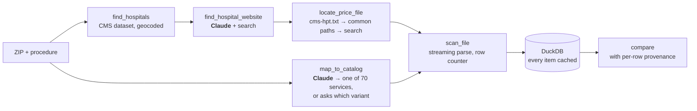

# hospital-price-agent

Give it a ZIP code and one of the 70 services CMS says hospitals must price ("knee MRI",
"colonoscopy", "screening mammogram"). It finds the nearest hospitals, tracks down their
federally required price transparency files on the live web, streams through files that can
run to several gigabytes, and puts the cash prices side by side with a link to the exact
source file for every number, showing each step as it happens.

**Status: built in public, one milestone at a time.** What works today is below; the
checklist further down is kept current.

## What works today

```
$ hpa hospitals 77339
nearest 5 hospitals to 77339
    0.0 mi  ELITE HOSPITAL KINGWOOD  [670285, Acute Care Hospitals]  (ZIP centroid)
    1.9 mi  HCA HOUSTON HEALTHCARE KINGWOOD  [450775, Acute Care Hospitals]
    2.2 mi  MEMORIAL HERMANN SURGICAL HOSPITAL KINGWOOD  [670005, Acute Care Hospitals]
    3.5 mi  TOWNSEN MEMORIAL HOSPITAL  [670266, Acute Care Hospitals]
    4.7 mi  CLEVELAND EMERGENCY HOSPITAL  [670115, Acute Care Hospitals]

$ hpa catalog "knee mri"
5 services (0 of 70 hand-verified)
  CPT 73721          MRI scan of leg joint  [unverified]
  CPT 70553          MRI scan of brain before and after contrast  [unverified]
  ...
```

- **Hospital lookup** from CMS's Hospital General Information dataset (5,419 hospitals).
  Every street address is geocoded with the free Census Geocoder during setup: 4,621
  resolve to a rooftop point, 764 fall back to their ZIP centroid (marked as such), and 34
  can't be placed and are excluded rather than guessed.
- **A procedure catalog** of the 70 CMS-specified shoppable services, with plain-English
  aliases and a `verified` flag per service (see below).
- Tests run offline on small checked-in fixtures; CI runs them on Python 3.11 and 3.13.

## Roadmap

- [x] **1. Scaffold.** Hospital lookup by ZIP, geocoded; DuckDB store; the 70-service catalog
- [ ] **2. Discovery.** Find the website and price file for ~10 Houston-area hospitals; publish
      what breaks and how often; measure hospital-to-file match accuracy
- [ ] **3. Extraction.** Stream CMS v3.0 files (CSV wide, CSV tall, JSON; v2.x as legacy) into
      DuckDB with caching; report scan time, peak memory and cache speed-up on named files
- [ ] **4. One complete Houston example.** Five hospitals, one service category, real prices,
      clickable evidence; first hand-verified catalog entries
- [ ] **5. Pipeline + eval.** Claude at the fuzzy steps, CLI trace; accuracy reported here in
      four separate numbers: hospital match, extraction, comparison eligibility, unresolved
- [ ] **6. Web UI.** FastAPI + server-sent events; split pane, trace left, results right
- [ ] **7. Hosted demo** on pre-scanned Houston ZIPs, with live scans on request

## Try it

```bash
python3 -m venv .venv && source .venv/bin/activate
pip install -r requirements-lock.txt && pip install -e . --no-deps

hpa setup                    # downloads CMS + Census data (~8 MB) and geocodes; about a minute
hpa hospitals 77030          # Texas Medical Center: nearest 5
hpa hospitals 77494 --limit 8
hpa catalog                  # all 70 services
hpa catalog colonoscopy
pytest                       # offline, no API key
```

## How it works



The pipeline is ordinary, testable Python. Claude is used only where the input is fuzzy:
matching what the user typed to a catalog entry (or asking "with or without contrast?"),
picking a hospital's official website, matching a hospital to its entry in a health system's
`cms-hpt.txt`, and reading files that don't follow the CMS template. Everything else runs
without an API key, which is what makes the accuracy numbers meaningful.

Rules the system keeps:
- **Never invents a price.** A hospital that can't be resolved is listed as missing, with the reason.
- **Every number has its source**: the file URL, the row or JSON path, and the date the hospital published it.
- **Says when rows can't be compared.** Different billing classes, modifiers or bundled
  components are reported as such, not averaged away.
- **Percentages and algorithms stay as written.** "60% of billed charges" is never converted into dollars.
- **Never loads a whole file into memory.** Price files are parsed as streams.

## The procedure catalog

"Any procedure" was the original scope, but a model that turns free text into billing codes
can be confidently wrong, and a self-reported confidence score doesn't make it right. So the
catalog is CMS's own list of 70 shoppable services, the ones every hospital must price
([45 CFR 180.60](https://www.ecfr.gov/current/title-45/subtitle-A/subchapter-E/part-180/subpart-B/section-180.60)).
Every code the system scans for is one a person can check.

Each service carries a `verified` flag. It is set only after someone has checked, against
real hospital files, that rows matched on its codes describe the same service with the same
billing class and are fair to compare. **Today: 0 of 70 verified.** The count grows from
milestone 4, and unverified services still return results, labelled as unverified.

## Background: the rule, and who uses this data

Hospitals have had to publish their standard charges since **1 January 2021**. From
**1 July 2024** the file must follow CMS's standard template, and the current template,
**v3.0**, took effect on 1 January 2026 with enforcement from 1 April 2026. Each hospital
must also serve a `cms-hpt.txt` at its domain root pointing to the file. Compliance is
uneven: missing index files, dead links, login walls and off-template layouts are all
common, and handling them is most of the work.

This project only uses the four summary columns (gross charge, discounted cash price, and
the minimum and maximum negotiated rates), not payer-specific rates. That makes it a tool
for two things: **cash-price exploration** (what a self-pay patient would be charged, the
most comparable figure across hospitals) and **data-quality analysis** (which hospitals
publish usable files at all). Employer and insurer contract analysis needs the
payer-specific rates and is out of scope.

Consumer price shopping mostly doesn't work in practice: insured patients pay a share of a
negotiated rate, emergencies can't be shopped, and the price of a procedure depends on
what's bundled with it. The people who do use this data are self-insured employers,
benefits consultants and patient advocates, and they mostly work from the full payer-level
files.

## Where it's going: the trace

The end state is a page where the left pane shows the work as it happens:

```
nearest 5 hospitals to 77380
"knee MRI" -> MRI scan of leg joint (CPT 73721)  [unverified]
Houston Methodist The Woodlands: cms-hpt.txt found -> price file 2.1 GB, scanning
St. Luke's The Woodlands: cms-hpt.txt missing, searching site
Houston Methodist The Woodlands: 2 matching rows after 1.4M scanned
St. Luke's The Woodlands: no machine-readable file located — skipped
```

## Limitations

- **Geocoding covers 85% of hospitals.** The rest sit at their ZIP centroid, which can be a
  mile or two off and ties hospitals in the same ZIP; results say when that's the case. 34
  hospitals nationally can't be placed at all and are left out.
- The CMS Hospital General Information dataset **leaves out PPS-exempt cancer hospitals**
  (e.g. MD Anderson), so they won't appear until another source is added.
- VA and military hospitals are exempt from the price transparency rule and are excluded by
  default (`--all-types` includes them).
- Catalog codes are the 2020 primary codes CMS printed; a few services have several
  current codes or variants (e.g. knee MRI with contrast), which the catalog does not yet
  distinguish.
- Payer-specific negotiated rates are deliberately out of scope.
- CPT code descriptions are AMA-copyrighted and are not included; the catalog uses CMS's
  plain-English service names.

## Data sources

- [CMS Hospital General Information](https://data.cms.gov/provider-data/dataset/xubh-q36u):
  hospital names, addresses, types
- [Census Geocoder](https://geocoding.geo.census.gov/) (batch endpoint) and the
  [2024 ZCTA Gazetteer](https://www.census.gov/geographies/reference-files/time-series/geo/gazetteer-files.html)
- [CMS's 70 shoppable services](https://www.cms.gov/files/document/steps-making-public-standard-charges-shoppable-services.pdf)
  (Table 3, 84 FR 65571)
- Hospital price transparency files, fetched live from each hospital's site
  ([CMS data dictionary v3.0](https://github.com/CMSgov/hospital-price-transparency))

## License

MIT
